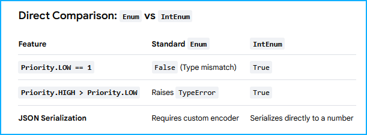
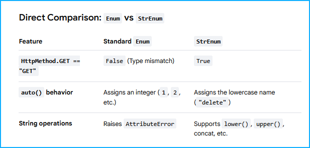

**Key Rules of Python EnumsConstants:** 

Enum members are read-only singletons. 
Attempting to modify their values at runtime will raise an AttributeError.

Uniqueness: While multiple names can have the same value (which creates an alias), 
names themselves must be unique.

Type-Specific Subclasses: If you need your enum members 
to explicitly behave like strings or integers in comparisons, you can use specialized 
base classes like StrEnum or IntEnum.

**Direct Comparison: Enum vs IntEnumFeatureStandard** 

**Direct Comparison: Enum vs StrEnum**

